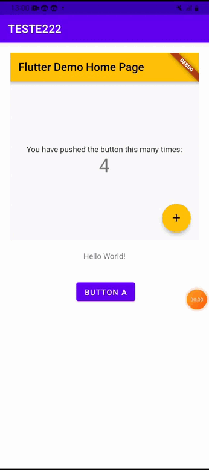
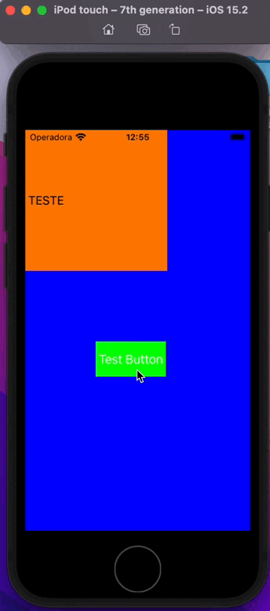

# Configuração do módulo Flutter em aplicativos nativos para iOS e Android


## Ordem das pastas
```
./nativo+flutter
./nativo+flutter/app_nativo_android
./nativo+flutter/app_nativo_ios
./nativo+flutter/modulo_flutter
```

## Criando o modulo Flutter 
```shell
$ flutter create -t module flutter_app
$ cd modulo_flutter
$ flutter pub get
```

# Configuration Android

### 1. Em Settings.gradle
```gradle
pluginManagement {
    repositories {
        gradlePluginPortal()
        google()
        mavenCentral()
    }
}
dependencyResolutionManagement {
    repositoriesMode.set(RepositoriesMode.PREFER_PROJECT)
    repositories {
        google()
        mavenCentral()
    }
}
include ':app'
setBinding(new Binding([gradle: this]))
evaluate(new File(
  settingsDir,
  '../flutter_module_ariel/.android/include_flutter.groovy'
))

```
### 2. Em app/build.gradle
```gradle
[...]

android {
    [...]

    compileOptions {
        sourceCompatibility JavaVersion.VERSION_1_8
        targetCompatibility JavaVersion.VERSION_1_8
    }

    [...]
}

dependencies {
    [...]

    implementation project(':flutter')
}
```
### 3. Em app/src/main/AndroidManifest.xml
```xml
[...]

<activity android:name=".CustomFlutterActivy"></activity>

<activity
    android:name="io.flutter.embedding.android.FlutterActivity"
    android:configChanges="orientation|keyboardHidden|keyboard|screenSize|locale|layoutDirection|fontScale|screenLayout|density|uiMode"
    android:hardwareAccelerated="true"
    android:windowSoftInputMode="adjustResize" />

[...]
```

### 4. Crienado um botãO para abrir uma tela do flutter - app/src/main/res/layout/activity_main.xml
```xml
    <Button
        android:id="@+id/button"
        android:layout_width="wrap_content"
        android:layout_height="wrap_content"
        android:layout_marginStart="161dp"
        android:layout_marginTop="57dp"
        android:layout_marginEnd="156dp"
        android:onClick="onButtonClick"
        android:text="Button a"
        app:layout_constraintEnd_toEndOf="parent"
        app:layout_constraintStart_toStartOf="parent"
        app:layout_constraintTop_toTopOf="@+id/textView" />
```

### 5. Em app/src/main/java/package/name/MainActivity.java
```java
package nativo.app.teste222;

import androidx.appcompat.app.AppCompatActivity;
import android.os.Bundle;
import android.view.View;

import io.flutter.embedding.android.FlutterActivity;
import io.flutter.embedding.engine.FlutterEngine;
import io.flutter.embedding.engine.FlutterEngineCache;
import io.flutter.embedding.engine.dart.DartExecutor;

public class MainActivity extends AppCompatActivity {
    public FlutterEngine flutterEngine;

    @Override
    protected void onCreate(Bundle savedInstanceState) {
        super.onCreate(savedInstanceState);
        setContentView(R.layout.activity_main);

        // Instantiate a FlutterEngine.
        flutterEngine = new FlutterEngine(this);

        // Configure an initial route.
        flutterEngine.getNavigationChannel().setInitialRoute("/");

        // Start executing Dart code to pre-warm the FlutterEngine.
        flutterEngine.getDartExecutor().executeDartEntrypoint(
                DartExecutor.DartEntrypoint.createDefault()
        );
        // Cache the FlutterEngine to be used by FlutterActivity or FlutterFragment.
        FlutterEngineCache
                .getInstance()
                .put("my_engine_id", flutterEngine);
    }

    public void onButtonClick(View view) {
        System.out.println("CLICK TO OPPEN");
        startActivity(
                ///DEMORA PARA ABRIR A NOVA TELA
                //FlutterActivity.createDefaultIntent(this)

                ///ABRE INSTANTANEAMENTE A NOVA TELA
                FlutterActivity
                        .withCachedEngine("my_engine_id")
                        .build(this)
        );
    }
}
```

# Configutando iOS

### 1. Criar o Podfile caso não exista
```shell
cd ./nativo+flutter/app_nativo_ios
pod init
```
>Apos isso o Podfile será criado

### 2. Adicionando o Flutter como dependencia no Podfile
```gradle
[...]

  ########### Adicionando Flutter como dependencia no projeto iOS  #########

flutter_application_path = '../modulo_flutter'
load File.join(flutter_application_path, '.ios', 'Flutter', 'podhelper.rb')

target 'app_nativo_ios' do
    install_all_flutter_pods(flutter_application_path)
end

post_install do |installer|
    flutter_post_install(installer) if defined?(flutter_post_install)
end


  #############################################################

[...]
```

### 3. Apos configurar o  Podfile, execute o  pod install
```shell
$ pod install
```

### 4. Em app_nativo_ios/AppDelegate.swift adicione o flutter engine, para "pre-aquecer o flutter e não ter que carrega-lo quando chama na primeira vez, caso contratrio, demora-rá para abrir a tela/layout flutter
```swift
[...]

    func application(_ application: UIApplication, didFinishLaunchingWithOptions launchOptions: [UIApplication.LaunchOptionsKey: Any]?) -> Bool {
        // Override point for customization after application launch.
        self.flutterEngine = FlutterEngine(name: "io.flutter", project: nil)
               self.flutterEngine?.run(withEntrypoint: nil)
        
        return true
    }

[...]

```


### 5. Altere o SceneDelegate para iniciar em outro tela
```swift
[...]

    window = UIWindow(windowScene: windowScene);
    window!.backgroundColor = .blue;
    window!.rootViewController = CombineVC();
    window!.makeKeyAndVisible();

[...]
```

### 5. Crie uma pasta chamada controller e dentro dela um arquivo chamado CombineVC.swift
```swift

import UIKit
import Flutter

class CombineVC: ViewController{
    
    override func viewDidLoad() {
        super.viewDidLoad();
        let whiteView = UILabel();
        
        whiteView.backgroundColor = .orange;
        whiteView.frame = CGRect(
            x: 0,
            y: 0,
            width: 202,
            height: 200
        );
        
        whiteView.text = " TESTE";
        
        let button = UIButton(frame: CGRect(x: 100, y: 300, width: 100, height: 50))
        button.backgroundColor = .green
        button.setTitle("Test Button", for: .normal)
        button.addTarget(self, action: #selector(buttonAction), for: .touchUpInside)

        self.view.addSubview(button)
        
        view.addSubview(whiteView);
    }
    
    @objc func buttonAction(sender: UIButton!) {
        print("Button tapped");
        if let flutterEngine = (UIApplication.shared.delegate as? AppDelegate)?.flutterEngine {
                    let flutterViewController = FlutterViewController(engine: flutterEngine, nibName: nil, bundle: nil)
                    flutterViewController.modalPresentationStyle = .fullScreen
                    self.present(flutterViewController, animated: true, completion: nil)
                    
                }
        
    }
    
}

```


# Result

 